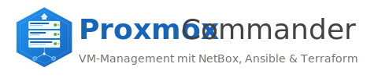

<p align="center">
  
</p>

<p align="center">
  <strong>VM-Management-Plattform fuer Proxmox VE</strong><br>
  mit integriertem NetBox (IPAM/DCIM), Ansible und Terraform
</p>

<p align="center">
  
  
  
  
</p>

---

## Zielgruppe

Proxmox Commander richtet sich an:

### Homelab-Betreiber
- **Einzel-Node bis Multi-Node Cluster** - Verwalte deinen Proxmox-Cluster ueber eine zentrale Oberflaeche
- **Automatisierte VM-Erstellung** - Cloud-Init Profile fuer schnelle Deployments
- **Lernumgebung** - Experimentiere mit Infrastructure-as-Code ohne Produktionsrisiko

### Kleine IT-Teams / KMU
- **Self-Service Portal** - Entwickler koennen VMs selbst anfordern
- **IP-Adressverwaltung** - NetBox IPAM verhindert IP-Konflikte
- **Audit-Trail** - Nachvollziehbare Aenderungen durch Ansible Execution History

### DevOps / Platform Engineers
- **GitOps-ready** - Terraform State und Ansible Playbooks als Code
- **API-first** - REST API fuer Integration in bestehende Pipelines
- **Multi-Tool Integration** - Proxmox + NetBox + Ansible + Terraform in einer UI

### Voraussetzungen fuer Nutzer

| Bereich | Grundkenntnisse | Erweiterte Nutzung |
|---------|-----------------|-------------------|
| **Proxmox VE** | Web-UI Bedienung, VM-Erstellung | API-Tokens, Templates, Cloud-Init |
| **Linux** | SSH, Basiskommandos | Ansible, Systemd, Netzwerk |
| **Docker** | `docker compose up/down` | Volumes, Networking, Logs |
| **Netzwerk** | IP-Adressen, Subnets | VLANs, Bridges, DNS |

---

## Features

- **VM-Deployment** via Terraform mit automatischer IP-Vergabe aus NetBox
- **Ansible Integration** mit Live-Output via WebSocket
- **NetBox IPAM** fuer IP-Adressverwaltung (integrierter Container)
- **Cloud-Init** mit 13 spezialisierten Profilen (vollstaendig konfigurierbar)
- **Inventory Sync** erkennt VM-Migrationen und aktualisiert Node-Zuordnung
- **Multi-Cluster** Unterstuetzung fuer mehrere Proxmox-Nodes
- **Theme-Auswahl** mit Hell/Dunkel/System-Modus

## Voraussetzungen

| Komponente | Minimum | Empfohlen |
|------------|---------|-----------|
| Docker | 24.x | 27.x+ |
| Docker Compose | v2.20 | v2.30+ |
| RAM | 4 GB* | 8 GB |
| Disk | 10 GB | 20 GB |

*4 GB ist das absolute Minimum - NetBox kann bei wenig RAM langsam starten (bis zu 5 Min).

**Proxmox VE Anforderungen:**
- Proxmox VE 8.x oder 9.x
- API-Token mit folgenden Berechtigungen:

| Berechtigung | Beschreibung |
|--------------|--------------|
| `VM.Allocate` | VMs erstellen |
| `VM.Clone` | Templates klonen |
| `VM.Config.Disk` | Disks konfigurieren |
| `VM.Config.CPU` | CPU konfigurieren |
| `VM.Config.Memory` | RAM konfigurieren |
| `VM.Config.Network` | Netzwerk konfigurieren |
| `VM.Config.Cloudinit` | Cloud-Init konfigurieren |
| `VM.Config.Options` | VM-Optionen aendern |
| `VM.PowerMgmt` | Start/Stop/Reboot |
| `VM.Audit` | VM-Konfiguration lesen |
| `VM.Snapshot` | Snapshots erstellen/loeschen |
| `VM.Snapshot.Rollback` | Snapshot-Rollback |
| `VM.Migrate` | VM-Migration |
| `Datastore.AllocateSpace` | Disk-Speicher anlegen |
| `Datastore.Audit` | Storage-Info lesen |
| `Sys.Audit` | Cluster-Ressourcen, Guest-Agent Status |
| `Sys.Modify` | Erweiterte Monitor-Befehle (optional) |

> **Hinweis PVE 9.x:** Die Berechtigung `VM.Monitor` wurde in Proxmox VE 9.0 entfernt.
> Stattdessen wird `Sys.Audit` fuer den Basiszugriff auf Guest-Agent und Monitor benoetigt.

**Empfohlene Rolle erstellen (Proxmox):**
```bash
pveum role add TerraformRole -privs "VM.Allocate VM.Clone VM.Config.Disk VM.Config.CPU VM.Config.Memory VM.Config.Network VM.Config.Cloudinit VM.Config.Options VM.PowerMgmt VM.Audit VM.Snapshot VM.Snapshot.Rollback VM.Migrate Datastore.AllocateSpace Datastore.Audit Sys.Audit"
pveum user add terraform@pve
pveum aclmod / -user terraform@pve -role TerraformRole
pveum user token add terraform@pve terraform-token --privsep=0
```

**Weitere Anforderungen:**
- SSH-Zugang zu den Nodes (fuer Cloud-Init Snippets auf NAS)
- Cloud-Init faehiges VM-Template

## Installation

### Quick Start (Empfohlen)

```bash
mkdir proxmox-commander && cd proxmox-commander
curl -LO https://raw.githubusercontent.com/dvaper/proxmox-commander/main/docker-compose.yml
docker compose up -d
# Browser: http://<server-ip>:8080/setup
```

### Vollstaendiges Repository klonen

```bash
git clone https://github.com/dvaper/proxmox-commander.git
cd proxmox-commander
```

**Optional: .env.example kopieren**
```bash
curl -LO https://raw.githubusercontent.com/dvaper/proxmox-commander/main/.env.example
cp .env.example .env
```

### 2. Container starten

```bash
docker compose up -d
```

**Erster Start dauert laenger** - NetBox muss initialisiert werden (ca. 2-5 Minuten).

### 3. Setup-Wizard durchfuehren

Oeffne im Browser:
```
http://<server-ip>:8080/setup
```

Der Setup-Wizard fragt folgende Informationen ab:

| Schritt | Erforderlich | Beschreibung |
|---------|--------------|--------------|
| Proxmox Host | Ja | URL zum Proxmox-Server (z.B. `https://proxmox.local:8006`) |
| Proxmox Token ID | Ja | Format: `user@realm!token-name` |
| Proxmox Token Secret | Ja | Das API-Token Secret |
| SSL verifizieren | Optional | Bei selbstsignierten Zertifikaten: Nein |
| SSH User | Ja | User fuer Ansible (z.B. `ansible`) |
| App-Admin User | Ja | Benutzername fuer die App |
| App-Admin Passwort | Ja | Mindestens 6 Zeichen |
| App-Admin E-Mail | Optional | E-Mail-Adresse |

### 4. Login

Nach dem Setup-Wizard:
```
http://<server-ip>:8080
```

Login mit den im Wizard angegebenen Credentials.

## Ports und Services

| Service | Port | Beschreibung |
|---------|------|--------------|
| Proxmox Commander | 8080 | Haupt-Webinterface |
| NetBox | 8081 | IPAM/DCIM Webinterface |

> **Tipp:** Die NetBox URL kann unter "Verwaltung > NetBox Integration" konfiguriert werden,
> um Links im UI (z.B. Dashboard, VM-Wizard) auf eine externe URL zu setzen.

**Interne Services (nicht von aussen erreichbar):**
- PostgreSQL (NetBox Datenbank)
- Redis (NetBox Cache)
- API Backend

## Datenverzeichnisse

Nach dem Start werden unter `./data/` erstellt:

```
./data/
├── db/              # SQLite Datenbank (App)
├── inventory/       # Ansible Inventory (YAML)
├── playbooks/       # Ansible Playbooks
├── roles/           # Ansible Roles
├── terraform/       # Terraform Konfigurationen
├── ssh/             # SSH Keys
├── netbox/          # NetBox Daten
│   ├── media/       # Uploads
│   ├── reports/     # Reports
│   └── scripts/     # Custom Scripts
└── postgres/        # PostgreSQL Daten (NetBox)
```

## Update

```bash
cd proxmox-commander
docker compose pull
docker compose up -d
```

**Spezifische Version installieren:**
```bash
VERSION=v0.3.0 docker compose pull
VERSION=v0.3.0 docker compose up -d
```

**Hinweis:** Datenbank-Migrationen werden automatisch beim Start ausgefuehrt.

## Konfiguration

### Umgebungsvariablen

Die wichtigsten Variablen in `.env`:

| Variable | Default | Beschreibung |
|----------|---------|--------------|
| `APP_PORT` | 8080 | Port fuer das Webinterface |
| `NETBOX_PORT` | 8081 | Port fuer NetBox |
| `PROXMOX_HOST` | - | Proxmox API URL |
| `PROXMOX_TOKEN_ID` | - | API Token ID |
| `PROXMOX_TOKEN_SECRET` | - | API Token Secret |
| `PROXMOX_VERIFY_SSL` | true | SSL-Zertifikat pruefen |
| `SECRET_KEY` | (generiert) | JWT Secret Key |
| `APP_ADMIN_USER` | admin | Admin-Benutzername |
| `APP_ADMIN_PASSWORD` | - | Admin-Passwort |

### Externes NetBox verwenden

Falls ein bestehendes NetBox verwendet werden soll:

1. In `.env` hinzufuegen:
   ```
   NETBOX_URL=http://external-netbox:8080
   NETBOX_TOKEN=<api-token>
   ```

2. NetBox-Container deaktivieren (optional):
   ```bash
   docker compose up -d dpc-frontend dpc-api
   ```

## Troubleshooting

### Container startet nicht

```bash
# Logs pruefen
docker compose logs dpc-api

# Haeufige Fehler:
# - "no such column: users.theme" -> Update auf v0.2.21+
# - "NetBox not ready" -> Warten, NetBox braucht Zeit zum Starten
```

### Login funktioniert nicht

1. `.env` pruefen - ist `APP_ADMIN_PASSWORD` gesetzt?
2. Container neu starten: `docker compose restart dpc-api`
3. Logs pruefen: `docker compose logs dpc-api | grep -i admin`

### NetBox zeigt Fehler

```bash
# NetBox-Status pruefen
docker compose logs netbox | tail -50

# NetBox neu starten
docker compose restart netbox netbox-worker netbox-housekeeping
```

### Proxmox-Verbindung fehlgeschlagen

1. API-Token Berechtigungen pruefen
2. Firewall-Regeln pruefen (Port 8006)
3. SSL-Einstellung pruefen (`PROXMOX_VERIFY_SSL=false` bei selbstsignierten Zertifikaten)

## Architektur


### Komponenten-Uebersicht

| Komponente | Technologie | Funktion |
|------------|-------------|----------|
| **Frontend** | Vue.js 3 + Vuetify 3 | Single-Page Application |
| **Backend** | FastAPI (Python) | REST API, WebSocket, Ansible/Terraform Runner |
| **NetBox** | Django (Python) | IPAM/DCIM - IP-Adressverwaltung |
| **Datenbank** | SQLite (App), PostgreSQL (NetBox) | Persistenz |
| **Terraform** | bpg/proxmox Provider | VM-Provisioning |
| **Ansible** | Built-in | Konfigurationsmanagement |

## Deployment in eigene Umgebung

### Schnellstart (Empfohlen)

Die einfachste Methode fuer eine neue Umgebung:

```bash
# 1. Nur docker-compose.yml herunterladen
mkdir proxmox-commander && cd proxmox-commander
curl -LO https://raw.githubusercontent.com/dvaper/proxmox-commander/main/docker-compose.yml

# 2. Container starten
docker compose up -d

# 3. Setup-Wizard durchfuehren
# Browser: http://<server-ip>:8080/setup
```

Der Setup-Wizard konfiguriert automatisch:
- Proxmox API-Verbindung
- Admin-Benutzer und Passwort
- NetBox Integration
- Terraform Provider

### Anpassungen fuer Produktivbetrieb

| Aspekt | Standard | Empfehlung |
|--------|----------|------------|
| **Secrets** | Auto-generiert | In `.env` persistent speichern |
| **Reverse Proxy** | Direkt :8080/:8081 | Nginx/Traefik mit SSL davor |
| **Backup** | Keins | `./data/` regelmaessig sichern |
| **Updates** | Manuell | `docker compose pull && up -d` |

### Cloud-Init Konfiguration

Ab **v0.2.43** sind alle Cloud-Init Einstellungen ueber die Web-UI konfigurierbar:

| Einstellung | Ort | Beschreibung |
|-------------|-----|--------------|
| SSH Public Keys | Verwaltung > Cloud-Init | Keys fuer VM-Zugang |
| Phone-Home URL | Verwaltung > Cloud-Init | Callback nach VM-Start |
| Admin-Username | Verwaltung > Cloud-Init | Default-User in VMs |
| NAS Snippets | Verwaltung > Cloud-Init | Pfad fuer Cloud-Init Dateien |

Diese Einstellungen koennen auch im **Setup-Wizard** bei der Ersteinrichtung gesetzt werden.

### Systemanforderungen

| Ressource | Minimum | Empfohlen | Hinweis |
|-----------|---------|-----------|---------|
| **CPU** | 2 Cores | 4 Cores | NetBox braucht CPU beim Start |
| **RAM** | 4 GB | 8 GB | NetBox + PostgreSQL speicherintensiv |
| **Disk** | 10 GB | 20 GB | Logs, DB, Terraform State |
| **OS** | Linux x86_64 | Debian/Ubuntu | Docker muss laufen |

### Netzwerk-Voraussetzungen

```
┌─────────────────┐      ┌─────────────────┐      ┌─────────────────┐
│   Browser       │─────▶│  Proxmox Cmdr   │─────▶│   Proxmox VE    │
│   (User)        │:8080 │  (Docker Host)  │:8006 │   (API)         │
└─────────────────┘      └────────┬────────┘      └─────────────────┘
                                  │:22
                                  ▼
                         ┌─────────────────┐
                         │   VMs/Targets   │
                         │   (Ansible)     │
                         └─────────────────┘
```

- **Outbound :8006** - Proxmox API (TCP)
- **Outbound :22** - SSH zu VMs fuer Ansible
- **Inbound :8080** - Web-UI (optional :8081 fuer NetBox direkt)

## Lizenz

MIT

## Changelog

Siehe [CHANGELOG](frontend/src/data/changelog.json) oder im UI unter dem Info-Icon.
