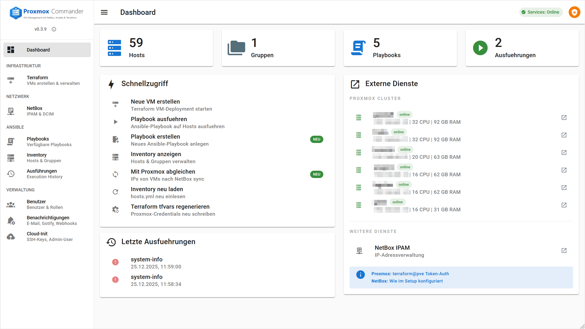
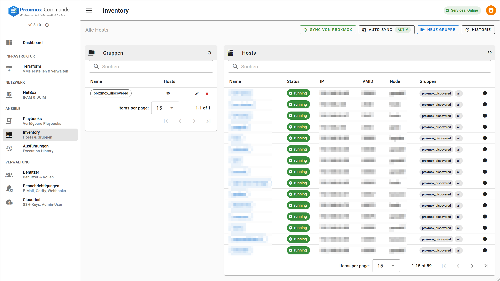
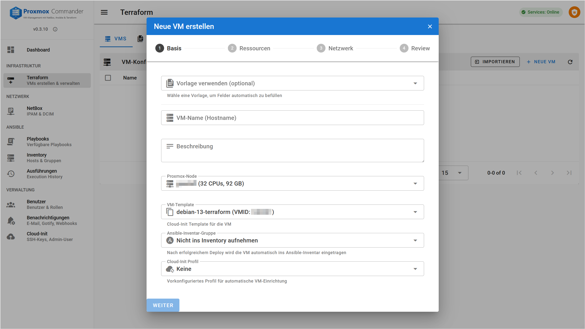
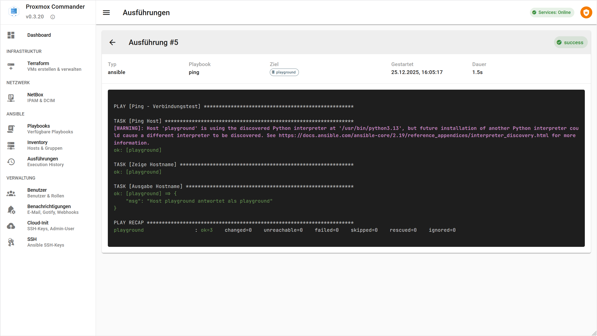
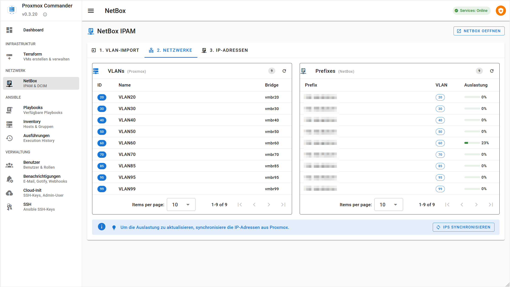
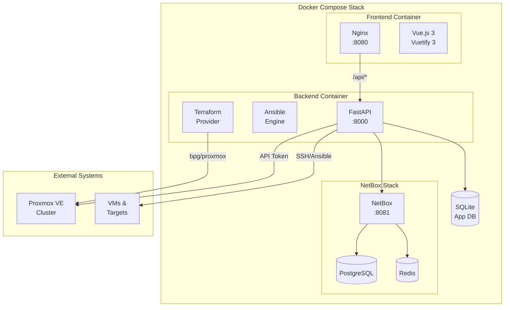

<p align="center">
  
</p>

<p align="center">
  <a href="#deutsch">🇩🇪 Deutsch</a> | <a href="#english">🇬🇧 English</a>
</p>

<p align="center">
  
  
  
  
</p>

---

<h1 id="deutsch">🇩🇪 Deutsch</h1>

**VM-Management-Plattform fuer Proxmox VE** mit integriertem NetBox (IPAM/DCIM), Ansible und Terraform

## Screenshots

<p align="center">
  <br>
  <em>Dashboard mit Cluster-Status und Schnellzugriff</em>
</p>

<details>
<summary><strong>Weitere Screenshots</strong></summary>

<p align="center">
  <br>
  <em>VM-Inventar mit Status-Anzeige</em>
</p>

<p align="center">
  <br>
  <em>VM-Deployment Wizard</em>
</p>

<p align="center">
  <br>
  <em>Ansible Playbook-Ausfuehrung mit Live-Output</em>
</p>

<p align="center">
  <br>
  <em>NetBox VLAN- und IP-Verwaltung</em>
</p>

</details>

---

## Zielgruppe

Proxmox Commander richtet sich an:

### Homelab-Betreiber
- **Einzel-Node bis Multi-Node Cluster** - Verwalte deinen Proxmox-Cluster ueber eine zentrale Oberflaeche
- **Automatisierte VM-Erstellung** - Cloud-Init Profile fuer schnelle Deployments
- **Lernumgebung** - Experimentiere mit Infrastructure-as-Code ohne Produktionsrisiko

### Kleine IT-Teams / KMU
- **Self-Service Portal** - Entwickler koennen VMs selbst anfordern
- **IP-Adressverwaltung** - NetBox IPAM verhindert IP-Konflikte
- **Audit-Trail** - Nachvollziehbare Aenderungen durch Ansible Execution History

### DevOps / Platform Engineers
- **GitOps-ready** - Terraform State und Ansible Playbooks als Code
- **API-first** - REST API fuer Integration in bestehende Pipelines
- **Multi-Tool Integration** - Proxmox + NetBox + Ansible + Terraform in einer UI

### Voraussetzungen fuer Nutzer

| Bereich | Grundkenntnisse | Erweiterte Nutzung |
|---------|-----------------|-------------------|
| **Proxmox VE** | Web-UI Bedienung, VM-Erstellung | API-Tokens, Templates, Cloud-Init |
| **Linux** | SSH, Basiskommandos | Ansible, Systemd, Netzwerk |
| **Docker** | `docker compose up/down` | Volumes, Networking, Logs |
| **Netzwerk** | IP-Adressen, Subnets | VLANs, Bridges, DNS |

---

## Features

- **VM-Deployment** via Terraform mit automatischer IP-Vergabe aus NetBox
- **Ansible Integration** mit Live-Output via WebSocket
- **NetBox IPAM** fuer IP-Adressverwaltung (integrierter Container)
- **Cloud-Init** mit 13 spezialisierten Profilen (vollstaendig konfigurierbar)
- **Inventory Sync** erkennt VM-Migrationen und aktualisiert Node-Zuordnung
- **Multi-Cluster** Unterstuetzung fuer mehrere Proxmox-Nodes
- **Theme-Auswahl** mit Hell/Dunkel/System-Modus
- **Backup & Restore** mit automatischem Zeitplan

## Voraussetzungen

| Komponente | Minimum | Empfohlen |
|------------|---------|-----------|
| Docker | 24.x | 27.x+ |
| Docker Compose | v2.20 | v2.30+ |
| RAM | 4 GB* | 8 GB |
| Disk | 10 GB | 20 GB |

*4 GB ist das absolute Minimum - NetBox kann bei wenig RAM langsam starten (bis zu 5 Min).

**Proxmox VE Anforderungen:**
- Proxmox VE 8.x oder 9.x
- API-Token mit folgenden Berechtigungen:

| Berechtigung | Beschreibung |
|--------------|--------------|
| `VM.Allocate` | VMs erstellen |
| `VM.Clone` | Templates klonen |
| `VM.Config.Disk` | Disks konfigurieren |
| `VM.Config.CPU` | CPU konfigurieren |
| `VM.Config.Memory` | RAM konfigurieren |
| `VM.Config.Network` | Netzwerk konfigurieren |
| `VM.Config.Cloudinit` | Cloud-Init konfigurieren |
| `VM.Config.Options` | VM-Optionen aendern |
| `VM.PowerMgmt` | Start/Stop/Reboot |
| `VM.Audit` | VM-Konfiguration lesen |
| `VM.Snapshot` | Snapshots erstellen/loeschen |
| `VM.Snapshot.Rollback` | Snapshot-Rollback |
| `VM.Migrate` | VM-Migration |
| `Datastore.AllocateSpace` | Disk-Speicher anlegen |
| `Datastore.Audit` | Storage-Info lesen |
| `Sys.Audit` | Cluster-Ressourcen, Guest-Agent Status |
| `Sys.Modify` | Erweiterte Monitor-Befehle (optional) |

> **Hinweis PVE 9.x:** Die Berechtigung `VM.Monitor` wurde in Proxmox VE 9.0 entfernt.
> Stattdessen wird `Sys.Audit` fuer den Basiszugriff auf Guest-Agent und Monitor benoetigt.

**Empfohlene Rolle erstellen (Proxmox):**
```bash
pveum role add TerraformRole -privs "VM.Allocate VM.Clone VM.Config.Disk VM.Config.CPU VM.Config.Memory VM.Config.Network VM.Config.Cloudinit VM.Config.Options VM.PowerMgmt VM.Audit VM.Snapshot VM.Snapshot.Rollback VM.Migrate Datastore.AllocateSpace Datastore.Audit Sys.Audit"
pveum user add terraform@pve
pveum aclmod / -user terraform@pve -role TerraformRole
pveum user token add terraform@pve terraform-token --privsep=0
```

**Weitere Anforderungen:**
- SSH-Zugang zu den Nodes (fuer Cloud-Init Snippets auf NAS)
- Cloud-Init faehiges VM-Template

## Installation

### Variante 1: Quick Start (lokaler Test)

Fuer schnelle Tests auf einem System mit Docker:

```bash
mkdir proxmox-commander && cd proxmox-commander
curl -LO https://raw.githubusercontent.com/dvaper/proxmox-commander/main/docker-compose.yml
docker compose up -d
# Browser: http://localhost:8080/setup
```

---

### Variante 2: Installation auf einer VM (Empfohlen fuer Produktion)

Diese Anleitung beschreibt die Installation auf einer dedizierten Linux-VM.

#### Schritt 1: VM vorbereiten

**Empfohlene VM-Konfiguration:**

| Ressource | Minimum | Empfohlen |
|-----------|---------|-----------|
| OS | Debian 12/13, Ubuntu 22.04/24.04 | Debian 13 |
| CPU | 2 Cores | 4 Cores |
| RAM | 4 GB | 8 GB |
| Disk | 20 GB | 40 GB |
| Netzwerk | Statische IP | VLAN-faehig |

#### Schritt 2: Docker installieren

**Debian/Ubuntu:**
```bash
# System aktualisieren
sudo apt update && sudo apt upgrade -y

# Docker-Abhaengigkeiten
sudo apt install -y ca-certificates curl gnupg

# Docker GPG Key
sudo install -m 0755 -d /etc/apt/keyrings
curl -fsSL https://download.docker.com/linux/debian/gpg | sudo gpg --dearmor -o /etc/apt/keyrings/docker.gpg
sudo chmod a+r /etc/apt/keyrings/docker.gpg

# Docker Repository (Debian)
echo "deb [arch=$(dpkg --print-architecture) signed-by=/etc/apt/keyrings/docker.gpg] https://download.docker.com/linux/debian $(. /etc/os-release && echo $VERSION_CODENAME) stable" | sudo tee /etc/apt/sources.list.d/docker.list > /dev/null

# Docker installieren
sudo apt update
sudo apt install -y docker-ce docker-ce-cli containerd.io docker-buildx-plugin docker-compose-plugin

# User zur docker-Gruppe hinzufuegen (Neuanmeldung erforderlich!)
sudo usermod -aG docker $USER
```

**Docker-Installation pruefen (nach Neuanmeldung):**
```bash
docker --version        # Erwartung: Docker version 24.x oder hoeher
docker compose version  # Erwartung: Docker Compose version v2.20 oder hoeher
```

#### Schritt 3: Anwendungsverzeichnis erstellen

```bash
# Verzeichnis erstellen
sudo mkdir -p /opt/proxmox-commander
sudo chown $USER:$USER /opt/proxmox-commander
cd /opt/proxmox-commander

# docker-compose.yml herunterladen
curl -LO https://raw.githubusercontent.com/dvaper/proxmox-commander/main/docker-compose.yml
```

#### Schritt 4: Container starten

```bash
cd /opt/proxmox-commander
docker compose up -d
```

**Erster Start dauert laenger** - NetBox muss initialisiert werden (ca. 2-5 Minuten).

**Start-Fortschritt pruefen:**
```bash
# Container-Status
docker compose ps

# Logs verfolgen (Abbruch mit Ctrl+C)
docker compose logs -f

# Warten bis "Application startup complete" erscheint
docker compose logs dpc-api | grep -i "startup complete"
```

#### Schritt 5: Setup-Wizard durchfuehren

Oeffne im Browser:
```
http://<vm-ip>:8080/setup
```

Der Setup-Wizard fragt folgende Informationen ab:

| Schritt | Erforderlich | Beschreibung |
|---------|--------------|--------------|
| Proxmox Host | Ja | URL zum Proxmox-Server (z.B. `https://192.168.1.10:8006`) |
| Proxmox Token ID | Ja | Format: `user@realm!token-name` |
| Proxmox Token Secret | Ja | Das API-Token Secret |
| SSL verifizieren | Optional | Bei selbstsignierten Zertifikaten: Nein |
| SSH User | Ja | User fuer Ansible (z.B. `ansible`) |
| App-Admin User | Ja | Benutzername fuer die App |
| App-Admin Passwort | Ja | Mindestens 8 Zeichen |
| App-Admin E-Mail | Optional | E-Mail-Adresse |

#### Schritt 6: Login

Nach dem Setup-Wizard:
```
http://<vm-ip>:8080
```

Login mit den im Wizard angegebenen Credentials.

---

### Variante 3: Mit Reverse Proxy (SSL/TLS)

Fuer Produktivbetrieb empfohlen: Nginx Proxy Manager, Traefik oder Nginx als Reverse Proxy.

**Beispiel: Nginx Proxy Manager**

1. Neuen Proxy Host erstellen:
   - Domain: `proxmox-commander.example.com`
   - Forward Hostname: `<vm-ip>`
   - Forward Port: `8080`
   - SSL: Let's Encrypt oder eigenes Zertifikat

2. Fuer NetBox separaten Proxy Host:
   - Domain: `netbox.example.com`
   - Forward Port: `8081`

3. **Wichtig bei NetBox ueber Reverse Proxy:**

   CSRF-Origins in `docker-compose.yml` anpassen:
   ```yaml
   netbox:
     environment:
       - CSRF_TRUSTED_ORIGINS=https://netbox.example.com
   ```

   Danach Container neu starten:
   ```bash
   docker compose up -d netbox
   ```

---

### Repository klonen (Entwicklung)

Fuer Entwicklung oder eigene Anpassungen:

```bash
git clone https://github.com/dvaper/proxmox-commander.git
cd proxmox-commander
docker compose up -d
```

## Ports und Services

| Service | Port | Beschreibung |
|---------|------|--------------|
| Proxmox Commander | 8080 | Haupt-Webinterface |
| NetBox | 8081 | IPAM/DCIM Webinterface |

> **Tipp:** Die NetBox URL kann unter "Verwaltung > NetBox Integration" konfiguriert werden,
> um Links im UI (z.B. Dashboard, VM-Wizard) auf eine externe URL zu setzen.

**Interne Services (nicht von aussen erreichbar):**
- PostgreSQL (NetBox Datenbank)
- Redis (NetBox Cache)
- API Backend

## Datenverzeichnisse

Nach dem Start werden unter `./data/` erstellt:

```
./data/
├── db/              # SQLite Datenbank (App)
├── inventory/       # Ansible Inventory (YAML)
├── playbooks/       # Ansible Playbooks
├── roles/           # Ansible Roles
├── terraform/       # Terraform Konfigurationen
├── ssh/             # SSH Keys
├── netbox/          # NetBox Daten
│   ├── media/       # Uploads
│   ├── reports/     # Reports
│   └── scripts/     # Custom Scripts
└── postgres/        # PostgreSQL Daten (NetBox)
```

## Update

```bash
cd proxmox-commander
docker compose pull
docker compose up -d
```

**Spezifische Version installieren:**
```bash
VERSION=v0.3.0 docker compose pull
VERSION=v0.3.0 docker compose up -d
```

**Hinweis:** Datenbank-Migrationen werden automatisch beim Start ausgefuehrt.

## Konfiguration

### Umgebungsvariablen

Die wichtigsten Variablen in `.env`:

| Variable | Default | Beschreibung |
|----------|---------|--------------|
| `APP_PORT` | 8080 | Port fuer das Webinterface |
| `NETBOX_PORT` | 8081 | Port fuer NetBox |
| `PROXMOX_HOST` | - | Proxmox API URL |
| `PROXMOX_TOKEN_ID` | - | API Token ID |
| `PROXMOX_TOKEN_SECRET` | - | API Token Secret |
| `PROXMOX_VERIFY_SSL` | true | SSL-Zertifikat pruefen |
| `SECRET_KEY` | (generiert) | JWT Secret Key |
| `APP_ADMIN_USER` | admin | Admin-Benutzername |
| `APP_ADMIN_PASSWORD` | - | Admin-Passwort |

### Externes NetBox verwenden

Falls ein bestehendes NetBox verwendet werden soll:

1. In `.env` hinzufuegen:
   ```
   NETBOX_URL=http://external-netbox:8080
   NETBOX_TOKEN=<api-token>
   ```

2. NetBox-Container deaktivieren (optional):
   ```bash
   docker compose up -d dpc-frontend dpc-api
   ```

## Troubleshooting

### Container startet nicht

```bash
# Logs pruefen
docker compose logs dpc-api

# Haeufige Fehler:
# - "no such column: users.theme" -> Update auf v0.2.21+
# - "NetBox not ready" -> Warten, NetBox braucht Zeit zum Starten
```

### Login funktioniert nicht

1. `.env` pruefen - ist `APP_ADMIN_PASSWORD` gesetzt?
2. Container neu starten: `docker compose restart dpc-api`
3. Logs pruefen: `docker compose logs dpc-api | grep -i admin`

### NetBox zeigt Fehler

```bash
# NetBox-Status pruefen
docker compose logs netbox | tail -50

# NetBox neu starten
docker compose restart netbox netbox-worker netbox-housekeeping
```

### Proxmox-Verbindung fehlgeschlagen

1. API-Token Berechtigungen pruefen
2. Firewall-Regeln pruefen (Port 8006)
3. SSL-Einstellung pruefen (`PROXMOX_VERIFY_SSL=false` bei selbstsignierten Zertifikaten)

## Architektur


### Komponenten-Uebersicht

| Komponente | Technologie | Funktion |
|------------|-------------|----------|
| **Frontend** | Vue.js 3 + Vuetify 3 | Single-Page Application |
| **Backend** | FastAPI (Python) | REST API, WebSocket, Ansible/Terraform Runner |
| **NetBox** | Django (Python) | IPAM/DCIM - IP-Adressverwaltung |
| **Datenbank** | SQLite (App), PostgreSQL (NetBox) | Persistenz |
| **Terraform** | bpg/proxmox Provider | VM-Provisioning |
| **Ansible** | Built-in | Konfigurationsmanagement |

## Netzwerk-Voraussetzungen

```
┌─────────────────┐      ┌─────────────────┐      ┌─────────────────┐
│   Browser       │─────▶│  Proxmox Cmdr   │─────▶│   Proxmox VE    │
│   (User)        │:8080 │  (Docker Host)  │:8006 │   (API)         │
└─────────────────┘      └────────┬────────┘      └─────────────────┘
                                 │:22
                                 ▼
                        ┌─────────────────┐
                        │   VMs/Targets   │
                        │   (Ansible)     │
                        └─────────────────┘
```

| Richtung | Port | Ziel | Beschreibung |
|----------|------|------|--------------|
| Outbound | 8006 | Proxmox VE | API-Kommunikation |
| Outbound | 22 | VMs/Targets | SSH fuer Ansible |
| Inbound | 8080 | Clients | Web-UI |
| Inbound | 8081 | Clients | NetBox (optional) |

## Backup und Wartung

### Backup

Die App bietet ein integriertes Backup-Feature unter **Verwaltung > Backup & Restore**:

- **Manuelle Backups** mit selektiven Komponenten
- **Geplante Backups** (taeglich/woechentlich)
- **Download** oder **Restore** direkt aus der UI

Alternativ alle persistenten Daten manuell sichern:

```bash
# Backup erstellen
cd /opt/proxmox-commander
tar -czvf backup-$(date +%Y%m%d).tar.gz data/

# Wichtige Unterverzeichnisse:
# - data/db/          - SQLite Datenbank (App)
# - data/postgres/    - PostgreSQL (NetBox)
# - data/config/      - Konfiguration (.env)
# - data/ssh/         - SSH Keys
# - data/terraform/   - Terraform State
```

### Produktivbetrieb Checkliste

| Aspekt | Standard | Empfehlung |
|--------|----------|------------|
| **Secrets** | Auto-generiert | In `.env` persistent speichern |
| **Reverse Proxy** | Direkt :8080/:8081 | Nginx/Traefik mit SSL davor |
| **Backup** | Keins | `./data/` regelmaessig sichern |
| **Updates** | Manuell | `docker compose pull && up -d` |
| **Monitoring** | Keins | Health-Endpoint `/api/health` ueberwachen |

## Cloud-Init Konfiguration

Ab **v0.2.43** sind alle Cloud-Init Einstellungen ueber die Web-UI konfigurierbar:

| Einstellung | Ort | Beschreibung |
|-------------|-----|--------------|
| SSH Public Keys | Verwaltung > Cloud-Init | Keys fuer VM-Zugang |
| Phone-Home URL | Verwaltung > Cloud-Init | Callback nach VM-Start |
| Admin-Username | Verwaltung > Cloud-Init | Default-User in VMs |
| NAS Snippets | Verwaltung > Cloud-Init | Pfad fuer Cloud-Init Dateien |

Diese Einstellungen koennen auch im **Setup-Wizard** bei der Ersteinrichtung gesetzt werden.

## Lizenz

MIT

## Changelog

Siehe [CHANGELOG](frontend/src/data/changelog.json) oder im UI unter dem Info-Icon.

---

<h1 id="english">🇬🇧 English</h1>

**VM Management Platform for Proxmox VE** with integrated NetBox (IPAM/DCIM), Ansible and Terraform

## Screenshots

<p align="center">
  <br>
  <em>Dashboard with cluster status and quick access</em>
</p>

<details>
<summary><strong>More Screenshots</strong></summary>

<p align="center">
  <br>
  <em>VM inventory with status display</em>
</p>

<p align="center">
  <br>
  <em>VM Deployment Wizard</em>
</p>

<p align="center">
  <br>
  <em>Ansible playbook execution with live output</em>
</p>

<p align="center">
  <br>
  <em>NetBox VLAN and IP management</em>
</p>

</details>

---

## Target Audience

Proxmox Commander is designed for:

### Homelab Operators
- **Single-node to multi-node clusters** - Manage your Proxmox cluster from a central interface
- **Automated VM creation** - Cloud-Init profiles for quick deployments
- **Learning environment** - Experiment with Infrastructure-as-Code without production risk

### Small IT Teams / SMBs
- **Self-service portal** - Developers can request VMs themselves
- **IP address management** - NetBox IPAM prevents IP conflicts
- **Audit trail** - Traceable changes through Ansible Execution History

### DevOps / Platform Engineers
- **GitOps-ready** - Terraform State and Ansible Playbooks as code
- **API-first** - REST API for integration into existing pipelines
- **Multi-tool integration** - Proxmox + NetBox + Ansible + Terraform in one UI

### User Prerequisites

| Area | Basic Knowledge | Advanced Usage |
|------|-----------------|----------------|
| **Proxmox VE** | Web UI operation, VM creation | API tokens, templates, Cloud-Init |
| **Linux** | SSH, basic commands | Ansible, Systemd, networking |
| **Docker** | `docker compose up/down` | Volumes, networking, logs |
| **Networking** | IP addresses, subnets | VLANs, bridges, DNS |

---

## Features

- **VM Deployment** via Terraform with automatic IP allocation from NetBox
- **Ansible Integration** with live output via WebSocket
- **NetBox IPAM** for IP address management (integrated container)
- **Cloud-Init** with 13 specialized profiles (fully configurable)
- **Inventory Sync** detects VM migrations and updates node assignments
- **Multi-Cluster** support for multiple Proxmox nodes
- **Theme Selection** with light/dark/system mode
- **Backup & Restore** with automatic scheduling

## Requirements

| Component | Minimum | Recommended |
|-----------|---------|-------------|
| Docker | 24.x | 27.x+ |
| Docker Compose | v2.20 | v2.30+ |
| RAM | 4 GB* | 8 GB |
| Disk | 10 GB | 20 GB |

*4 GB is the absolute minimum - NetBox may start slowly with low RAM (up to 5 min).

**Proxmox VE Requirements:**
- Proxmox VE 8.x or 9.x
- API token with the following permissions:

| Permission | Description |
|------------|-------------|
| `VM.Allocate` | Create VMs |
| `VM.Clone` | Clone templates |
| `VM.Config.Disk` | Configure disks |
| `VM.Config.CPU` | Configure CPU |
| `VM.Config.Memory` | Configure RAM |
| `VM.Config.Network` | Configure network |
| `VM.Config.Cloudinit` | Configure Cloud-Init |
| `VM.Config.Options` | Change VM options |
| `VM.PowerMgmt` | Start/Stop/Reboot |
| `VM.Audit` | Read VM configuration |
| `VM.Snapshot` | Create/delete snapshots |
| `VM.Snapshot.Rollback` | Snapshot rollback |
| `VM.Migrate` | VM migration |
| `Datastore.AllocateSpace` | Allocate disk space |
| `Datastore.Audit` | Read storage info |
| `Sys.Audit` | Cluster resources, guest agent status |
| `Sys.Modify` | Advanced monitor commands (optional) |

> **Note PVE 9.x:** The `VM.Monitor` permission was removed in Proxmox VE 9.0.
> Instead, `Sys.Audit` is required for basic guest agent and monitor access.

**Create recommended role (Proxmox):**
```bash
pveum role add TerraformRole -privs "VM.Allocate VM.Clone VM.Config.Disk VM.Config.CPU VM.Config.Memory VM.Config.Network VM.Config.Cloudinit VM.Config.Options VM.PowerMgmt VM.Audit VM.Snapshot VM.Snapshot.Rollback VM.Migrate Datastore.AllocateSpace Datastore.Audit Sys.Audit"
pveum user add terraform@pve
pveum aclmod / -user terraform@pve -role TerraformRole
pveum user token add terraform@pve terraform-token --privsep=0
```

**Additional Requirements:**
- SSH access to nodes (for Cloud-Init snippets on NAS)
- Cloud-Init capable VM template

## Installation

### Option 1: Quick Start (Local Testing)

For quick tests on a system with Docker:

```bash
mkdir proxmox-commander && cd proxmox-commander
curl -LO https://raw.githubusercontent.com/dvaper/proxmox-commander/main/docker-compose.yml
docker compose up -d
# Browser: http://localhost:8080/setup
```

---

### Option 2: Installation on a VM (Recommended for Production)

This guide describes installation on a dedicated Linux VM.

#### Step 1: Prepare VM

**Recommended VM configuration:**

| Resource | Minimum | Recommended |
|----------|---------|-------------|
| OS | Debian 12/13, Ubuntu 22.04/24.04 | Debian 13 |
| CPU | 2 cores | 4 cores |
| RAM | 4 GB | 8 GB |
| Disk | 20 GB | 40 GB |
| Network | Static IP | VLAN-capable |

#### Step 2: Install Docker

**Debian/Ubuntu:**
```bash
# Update system
sudo apt update && sudo apt upgrade -y

# Docker dependencies
sudo apt install -y ca-certificates curl gnupg

# Docker GPG Key
sudo install -m 0755 -d /etc/apt/keyrings
curl -fsSL https://download.docker.com/linux/debian/gpg | sudo gpg --dearmor -o /etc/apt/keyrings/docker.gpg
sudo chmod a+r /etc/apt/keyrings/docker.gpg

# Docker Repository (Debian)
echo "deb [arch=$(dpkg --print-architecture) signed-by=/etc/apt/keyrings/docker.gpg] https://download.docker.com/linux/debian $(. /etc/os-release && echo $VERSION_CODENAME) stable" | sudo tee /etc/apt/sources.list.d/docker.list > /dev/null

# Install Docker
sudo apt update
sudo apt install -y docker-ce docker-ce-cli containerd.io docker-buildx-plugin docker-compose-plugin

# Add user to docker group (re-login required!)
sudo usermod -aG docker $USER
```

**Verify Docker installation (after re-login):**
```bash
docker --version        # Expected: Docker version 24.x or higher
docker compose version  # Expected: Docker Compose version v2.20 or higher
```

#### Step 3: Create Application Directory

```bash
# Create directory
sudo mkdir -p /opt/proxmox-commander
sudo chown $USER:$USER /opt/proxmox-commander
cd /opt/proxmox-commander

# Download docker-compose.yml
curl -LO https://raw.githubusercontent.com/dvaper/proxmox-commander/main/docker-compose.yml
```

#### Step 4: Start Containers

```bash
cd /opt/proxmox-commander
docker compose up -d
```

**First start takes longer** - NetBox needs to initialize (approx. 2-5 minutes).

**Check startup progress:**
```bash
# Container status
docker compose ps

# Follow logs (cancel with Ctrl+C)
docker compose logs -f

# Wait until "Application startup complete" appears
docker compose logs dpc-api | grep -i "startup complete"
```

#### Step 5: Complete Setup Wizard

Open in browser:
```
http://<vm-ip>:8080/setup
```

The setup wizard asks for the following information:

| Step | Required | Description |
|------|----------|-------------|
| Proxmox Host | Yes | URL to Proxmox server (e.g., `https://192.168.1.10:8006`) |
| Proxmox Token ID | Yes | Format: `user@realm!token-name` |
| Proxmox Token Secret | Yes | The API token secret |
| Verify SSL | Optional | For self-signed certificates: No |
| SSH User | Yes | User for Ansible (e.g., `ansible`) |
| App Admin User | Yes | Username for the app |
| App Admin Password | Yes | Minimum 8 characters |
| App Admin Email | Optional | Email address |

#### Step 6: Login

After the setup wizard:
```
http://<vm-ip>:8080
```

Login with the credentials specified in the wizard.

---

### Option 3: With Reverse Proxy (SSL/TLS)

Recommended for production: Nginx Proxy Manager, Traefik, or Nginx as reverse proxy.

**Example: Nginx Proxy Manager**

1. Create new proxy host:
   - Domain: `proxmox-commander.example.com`
   - Forward Hostname: `<vm-ip>`
   - Forward Port: `8080`
   - SSL: Let's Encrypt or custom certificate

2. For NetBox, create separate proxy host:
   - Domain: `netbox.example.com`
   - Forward Port: `8081`

3. **Important for NetBox via reverse proxy:**

   Adjust CSRF origins in `docker-compose.yml`:
   ```yaml
   netbox:
     environment:
       - CSRF_TRUSTED_ORIGINS=https://netbox.example.com
   ```

   Then restart container:
   ```bash
   docker compose up -d netbox
   ```

---

### Clone Repository (Development)

For development or custom modifications:

```bash
git clone https://github.com/dvaper/proxmox-commander.git
cd proxmox-commander
docker compose up -d
```

## Ports and Services

| Service | Port | Description |
|---------|------|-------------|
| Proxmox Commander | 8080 | Main web interface |
| NetBox | 8081 | IPAM/DCIM web interface |

> **Tip:** The NetBox URL can be configured under "Settings > NetBox Integration"
> to point UI links (e.g., dashboard, VM wizard) to an external URL.

**Internal services (not externally accessible):**
- PostgreSQL (NetBox database)
- Redis (NetBox cache)
- API Backend

## Data Directories

After startup, the following are created under `./data/`:

```
./data/
├── db/              # SQLite database (App)
├── inventory/       # Ansible Inventory (YAML)
├── playbooks/       # Ansible Playbooks
├── roles/           # Ansible Roles
├── terraform/       # Terraform configurations
├── ssh/             # SSH Keys
├── netbox/          # NetBox data
│   ├── media/       # Uploads
│   ├── reports/     # Reports
│   └── scripts/     # Custom Scripts
└── postgres/        # PostgreSQL data (NetBox)
```

## Update

```bash
cd proxmox-commander
docker compose pull
docker compose up -d
```

**Install specific version:**
```bash
VERSION=v0.3.0 docker compose pull
VERSION=v0.3.0 docker compose up -d
```

**Note:** Database migrations are automatically executed on startup.

## Configuration

### Environment Variables

The most important variables in `.env`:

| Variable | Default | Description |
|----------|---------|-------------|
| `APP_PORT` | 8080 | Port for web interface |
| `NETBOX_PORT` | 8081 | Port for NetBox |
| `PROXMOX_HOST` | - | Proxmox API URL |
| `PROXMOX_TOKEN_ID` | - | API Token ID |
| `PROXMOX_TOKEN_SECRET` | - | API Token Secret |
| `PROXMOX_VERIFY_SSL` | true | Verify SSL certificate |
| `SECRET_KEY` | (generated) | JWT Secret Key |
| `APP_ADMIN_USER` | admin | Admin username |
| `APP_ADMIN_PASSWORD` | - | Admin password |

### Using External NetBox

If using an existing NetBox:

1. Add to `.env`:
   ```
   NETBOX_URL=http://external-netbox:8080
   NETBOX_TOKEN=<api-token>
   ```

2. Disable NetBox container (optional):
   ```bash
   docker compose up -d dpc-frontend dpc-api
   ```

## Troubleshooting

### Container Won't Start

```bash
# Check logs
docker compose logs dpc-api

# Common errors:
# - "no such column: users.theme" -> Update to v0.2.21+
# - "NetBox not ready" -> Wait, NetBox needs time to start
```

### Login Not Working

1. Check `.env` - is `APP_ADMIN_PASSWORD` set?
2. Restart container: `docker compose restart dpc-api`
3. Check logs: `docker compose logs dpc-api | grep -i admin`

### NetBox Shows Errors

```bash
# Check NetBox status
docker compose logs netbox | tail -50

# Restart NetBox
docker compose restart netbox netbox-worker netbox-housekeeping
```

### Proxmox Connection Failed

1. Check API token permissions
2. Check firewall rules (port 8006)
3. Check SSL setting (`PROXMOX_VERIFY_SSL=false` for self-signed certificates)

## Architecture



### Components Overview

| Component | Technology | Function |
|-----------|------------|----------|
| **Frontend** | Vue.js 3 + Vuetify 3 | Single-Page Application |
| **Backend** | FastAPI (Python) | REST API, WebSocket, Ansible/Terraform Runner |
| **NetBox** | Django (Python) | IPAM/DCIM - IP address management |
| **Database** | SQLite (App), PostgreSQL (NetBox) | Persistence |
| **Terraform** | bpg/proxmox Provider | VM provisioning |
| **Ansible** | Built-in | Configuration management |

## Network Requirements

```
┌─────────────────┐      ┌─────────────────┐      ┌─────────────────┐
│   Browser       │─────▶│  Proxmox Cmdr   │─────▶│   Proxmox VE    │
│   (User)        │:8080 │  (Docker Host)  │:8006 │   (API)         │
└─────────────────┘      └────────┬────────┘      └─────────────────┘
                                 │:22
                                 ▼
                        ┌─────────────────┐
                        │   VMs/Targets   │
                        │   (Ansible)     │
                        └─────────────────┘
```

| Direction | Port | Target | Description |
|-----------|------|--------|-------------|
| Outbound | 8006 | Proxmox VE | API communication |
| Outbound | 22 | VMs/Targets | SSH for Ansible |
| Inbound | 8080 | Clients | Web UI |
| Inbound | 8081 | Clients | NetBox (optional) |

## Backup and Maintenance

### Backup

The app provides an integrated backup feature under **Settings > Backup & Restore**:

- **Manual backups** with selective components
- **Scheduled backups** (daily/weekly)
- **Download** or **restore** directly from the UI

Alternatively, backup all persistent data manually:

```bash
# Create backup
cd /opt/proxmox-commander
tar -czvf backup-$(date +%Y%m%d).tar.gz data/

# Important subdirectories:
# - data/db/          - SQLite database (App)
# - data/postgres/    - PostgreSQL (NetBox)
# - data/config/      - Configuration (.env)
# - data/ssh/         - SSH Keys
# - data/terraform/   - Terraform State
```

### Production Checklist

| Aspect | Default | Recommendation |
|--------|---------|----------------|
| **Secrets** | Auto-generated | Store persistently in `.env` |
| **Reverse Proxy** | Direct :8080/:8081 | Nginx/Traefik with SSL in front |
| **Backup** | None | Regularly backup `./data/` |
| **Updates** | Manual | `docker compose pull && up -d` |
| **Monitoring** | None | Monitor health endpoint `/api/health` |

## Cloud-Init Configuration

Since **v0.2.43**, all Cloud-Init settings are configurable via the web UI:

| Setting | Location | Description |
|---------|----------|-------------|
| SSH Public Keys | Settings > Cloud-Init | Keys for VM access |
| Phone-Home URL | Settings > Cloud-Init | Callback after VM start |
| Admin Username | Settings > Cloud-Init | Default user in VMs |
| NAS Snippets | Settings > Cloud-Init | Path for Cloud-Init files |

These settings can also be configured in the **Setup Wizard** during initial setup.

## License

MIT

## Changelog

See [CHANGELOG](frontend/src/data/changelog.json) or in the UI under the info icon.
